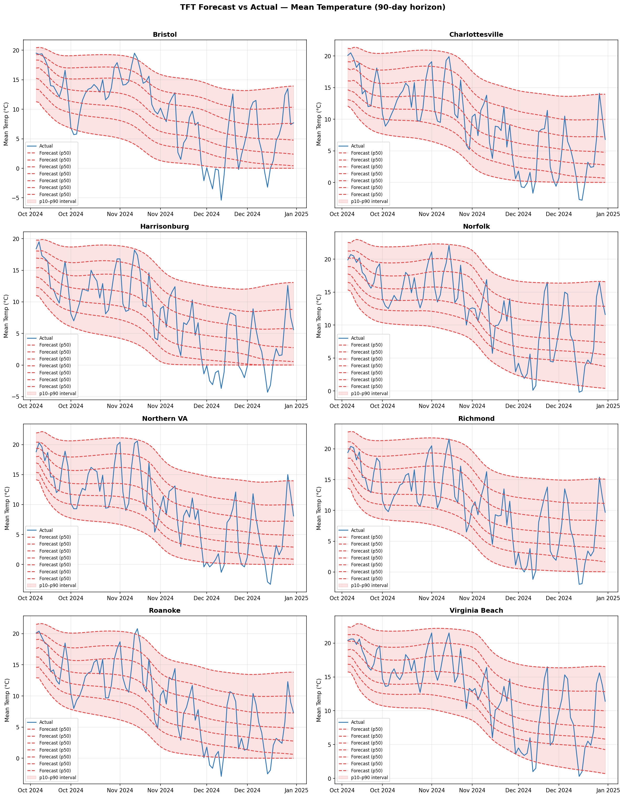

# DS 4320 Project 2: Forecasting Local Virginia Climate Change

#### Landon Burtle (xfd3tf)
#### License - [MIT](LICENSE)
#### Press Release - [Stop Guessing, Start Understanding: A Smarter Way to Read the Stock Market](PRESSRELEASE.md)
#### DOI - [](https://doi.org/10.5281/zenodo.19871455)

### Executive Summary

### Data

Repo Structure
```
.
├── LICENSE
├── PRESSRELEASE.md
├── README.md
├── checkpoints
│   ├── tft-best-v1.ckpt
│   ├── tft-best-v2.ckpt
│   ├── tft-best-v3.ckpt
│   ├── tft-best-v4.ckpt
│   ├── tft-best-v5.ckpt
│   ├── tft-best-v6.ckpt
│   └── tft-best.ckpt
├── images
│   ├── baseline_forecasts.png
│   ├── model_comparison.png
│   ├── rf_feature_importance.png
│   ├── temperature_trend.png
│   ├── tft_forecasts.png
│   └── warming_trends.png
├── lightning_logs
│   ├── version_0
│   │   └── hparams.yaml
│   ├── version_1
│   │   └── hparams.yaml
│   ├── version_2
│   │   └── hparams.yaml
│   ├── version_3
│   │   └── hparams.yaml
│   ├── version_4
│   │   └── hparams.yaml
│   ├── version_5
│   │   └── hparams.yaml
│   ├── version_6
│   │   └── hparams.yaml
│   └── version_7
│       └── hparams.yaml
├── pipeline.ipynb
├── pipeline.md
├── pipeline_files
│   ├── pipeline_1_10.png
│   ├── pipeline_1_11.png
│   ├── pipeline_1_12.png
│   ├── pipeline_1_13.png
│   └── pipeline_1_14.png
├── plots
├── scripts
│   ├── analysis.py
│   ├── baseline_models.py
│   ├── data.py
│   └── pressreleaseviz.py
└── weather_stats.json
```

### Pipeline

## Problem Definition

### Initial general problem: 
Forecasting global climate change

### Refined specific problem statement: 
Can we use the time-series temperature and weather data for specific locations to determine trends in climate change over long time periods?

### Rationale
The rationale for the refinement is that the original was too broad and did not specific what type of data would exactly be utilized for the 
forecasting. Another option could have been analyzing news reports, weather reports, possibly activity in growth of coal usage or fossil fuel
usage in general. Perhaps even the growth of companies who build factories or data centers, which might have an effect on the climate. To do 
something relevant to individual audiencies and which will give real specific data insights, I decided to take pure numerical values to find 
the trend and try to forecast future values.

### Motivation
The motivation for this project is to see if we can utilize data collected from specific locations over decades to determine the underlying 
effects or movement driven by climate change. This can be observed possibly in temperature highs, temperature lows, temperature ranges, precipitation,
maybe unusual weather, or other features. If we can train a model to understand the trend, given this small scope of information, we can build a rough
prediction for the future trend in climate change for different locations.

### Headline
From Weather Records to Climate Signals: Forecasting What the Data Is Telling Us About Virginia's Future [Press Release](PRESSRELEASE.md)

## Domain Exposition

### Terminology:

#### KPI/Jargon:

| Term | Definition |
| --- | --- |
| Time-series | Data collected at regular intervals over time (e.g. daily temperature readings) |
| Trend | The long-term directional movement in a variable, stripped of seasonal noise | 
| Forecast | A model-generated prediction of future values based on historical patterns | 
| Anomaly | A reading that deviates significantly from the historical average for that period | 
| Precipitation | Total measured rainfall/snowfall, typically in mm or inches per period | 
| KPI | Mean temp, temp range, annual precipitation |

### Domain:

This project lives at the intersection of climate science and machine learning. Meteorologists have
collected station-level weather data for over a century, but extracting meaningful long-term signals
requires separating seasonal cycles from genuine directional trends. Time-series forecasting models 
which range from classical approaches like ARIMA to modern deep learning offer a way to learn these 
patterns and project them forward, giving local, actionable climate insights rather than global abstractions.

### Background Reading:

| Title | Description | Link |
| --- | --- | --- |
| Long-term trends in climate extremes over North America | Reviews observed changes in temperature extremes and precipitation across North America using station data | [ClimateExtremes](https://drive.google.com/file/d/1cdLLtEJ-qpZrBnErfiYaDLHtgLQm8Ud-/view?usp=sharing) |
| North American Extreme Precipitation Events and Related Large-Scale Meteorological Patterns | Reviews statistical methods and trends in extreme precipitation across North America using GHCN station data | [NAExtremes](https://drive.google.com/file/d/1IDaBS6E_fERSzsEh3hl9ZzAicWEpLfuW/view?usp=sharing) |
| EPA Climate Change Indicators — Weather and Climate (archived) | Archived EPA page covering observed U.S. trends in temperature, precipitation, storms, and floods with charts from 2021 | [Indicators](https://drive.google.com/file/d/1XyQCWI1hRJVWOSZLh1fL_k0nQL9w9mQx/view?usp=drive_link) | 
| Deep Learning for Weather Forecasting: A CNN-LSTM Hybrid Model | Introduces a CNN-LSTM hybrid for temperature prediction, directly relevant to the ML modeling approach in this project | [WeatherDeepL](https://drive.google.com/file/d/1l0V-17GyHzzjvqRvxJL5-VQhkEB2BeK2/view?usp=drive_link) |
| Predicting Temperature of Major Cities Using Machine Learning and Deep Learning | Applies LSTM time-series forecasting to city-level temperature data | [PredictTemp](https://drive.google.com/file/d/1Kalkh-WpCEgKipAnqE63MaVryzW-fG54/view?usp=drive_link) |

Folder link: [Folder](https://drive.google.com/drive/folders/1wv7ClKKXRHVEOJxSl9rgs5q89Qdv5BSZ?usp=sharing)
----------------------

## Data Creation

The data used in this project consists of historical daily weather observations 
collected from eight locations across Virginia, spanning fifteen years from 
January 1, 2010 through December 31, 2024. The locations were selected to 
provide geographic diversity across the state, covering distinct climatic 
regions including Coastal (Virginia Beach, Norfolk), Piedmont (Charlottesville), 
Central (Richmond), Northern (Northern VA), Shenandoah (Harrisonburg), 
Southwest (Roanoke), and Appalachian (Bristol).

The data was retrieved programmatically via the Open-Meteo Historical Weather 
API, which serves ERA5 reanalysis data produced by the European Centre for 
Medium-Range Weather Forecasts (ECMWF). ERA5 is a globally recognized 
climate reanalysis dataset that combines historical weather model output with 
observational data from ground stations, weather balloons, satellites, and 
other sources to produce consistent, gap-free estimates on a 0.25° (~28km) 
spatial grid. Rather than serving raw sensor readings, Open-Meteo interpolates 
ERA5 grid values to the requested coordinates, making it suitable for 
systematic programmatic collection without requiring access to individual 
station archives.

For each location, thirteen daily meteorological variables were collected: 
maximum, minimum, and mean temperature; total precipitation and rain; snowfall; 
maximum wind speed and gusts; dominant wind direction; reference 
evapotranspiration; precipitation hours; sunshine duration; and shortwave solar 
radiation. This resulted in 43,832 total documents stored in a MongoDB time 
series collection, with each document representing one location-day pair.

The fifteen-year window was chosen deliberately to support the primary 
analytical goal of detecting and forecasting long-term climate trends. A shorter 
window would be insufficient to distinguish true warming signals from natural 
inter-annual variability. The eight-location scope was chosen to balance 
geographic coverage against the storage constraints of a free-tier MongoDB 
cluster (~512MB), with the full dataset occupying approximately 2.66MB — well 
within those limits while still providing meaningful spatial variation across 
the state.

| File | Description | Link |
|------|-------------|------|
| `data.py` | Python script which connects to the MongoDB Client then populates the `weather_db` database with records from each corresponding location over the past 15 years by polling the Open-Meteo API | [data.py](scripts/data.py)

### Bias Identification:

One type of bias that is evident in the data is the bias towards more populated areas. The weather stations are located in cities where the
information may be useful to more people, but not as accurate for those in the nearby area who are incorporated. There is also bias in the 
time scale that I chose to collect, where the recent trends in climate change may not be representative of historical changes, and there 
#might be a larger picture not clearly identified.

### Bias Mitigation:

One part of my rationale in how I handled the data is describe as above, with limiting the time scale for storage purposes. Another decision 
I had to make was the location of the data. Since I do not have much storage capacity in my MongoDB cluster, I opted to choose stations which
are nearby to Charlottesville so that I can make an analysis pipeline which is at least relevant to audience of our class. I also chose not 
to gather data from local weather stations because it would require a significantly higher level of effort, whereas I can get all the larger
station/region data from the Open-Meteo API.

### Rationale

One part of my rationale in how I handled the data is describe as above, with limiting the time scale for storage purposes. Another decision
I had to make was the location of the data. Since I do not have much storage capacity in my MongoDB cluster, I opted to choose stations which
are nearby to Charlottesville so that I can make an analysis pipeline which is at least relevant to audience of our class. I also chose not 
to gather data from local weather stations because it would require a significantly higher level of effort, whereas I can get all the larger 
station/region data from the Open-Meteo API.

-----------------
## Metadata

### Implicit schema:
`doc = {
            "timestamp": datetime.strptime(date_str, "%Y-%m-%d").replace(tzinfo=timezone.utc),

            # metadata field — indexed for fast filtering by location

            "metadata": {

                "location":  location["name"],

                "region":    location["region"],

                "latitude":  location["lat"],

                "longitude": location["lon"],

            },

            # measurements

            "temp_max_c":          daily["temperature_2m_max"][i],

            "temp_min_c":          daily["temperature_2m_min"][i],

            "temp_mean_c":         daily["temperature_2m_mean"][i],

            "precipitation_mm":    daily["precipitation_sum"][i],

            "rain_mm":             daily["rain_sum"][i],

            "snowfall_cm":         daily["snowfall_sum"][i],

            "wind_max_kmh":        daily["wind_speed_10m_max"][i],

            "wind_gust_kmh":       daily["wind_gusts_10m_max"][i],

            "wind_direction_deg":  daily["wind_direction_10m_dominant"][i],

            "evapotranspiration_mm": daily["et0_fao_evapotranspiration"][i],

            "precip_hours":        daily["precipitation_hours"][i],

            "sunshine_sec":        daily["sunshine_duration"][i],

            "solar_radiation_mj":  daily["shortwave_radiation_sum"][i],

        }
### Data Summary

#### Collection Overview

| **Property** | **Value** |
| --- | --- |
| **Database Name** | weather_db |
| **Collection Name** | weather (MongoDB Time Series Collection) |
| **Total Documents** | 43,832 |
| **Locations Covered** | 8 cities across Virginia |
| **Date Range** | January 1, 2010 → December 31, 2024 |
| **Temporal Resolution** | Daily (1 document per location per day) |
| **Documents per Location** | 5,479 days each |
| **Features per Document** | 13 numerical weather variables + timestamp + metadata |
| **Logical Size** | 2.66 MB |
| **Storage Size (compressed)** | 1.94 MB (time series columnar compression) |
| **Missing Values** | 0% across all 13 numerical fields |
| **Data Source** | Open-Meteo Historical Weather API (ERA5 reanalysis model) |

#### Locations

| **City / Location** | **Region** | **Coordinates** |
| --- | --- | --- |
| Bristol | Appalachian | 36.5951° N, 82.1887° W |
| Charlottesville | Piedmont | 38.0293° N, 78.4767° W |
| Harrisonburg | Shenandoah | 38.4496° N, 78.8689° W |
| Norfolk | Coastal | 36.8508° N, 76.2859° W |
| Northern VA | Northern | 38.8048° N, 77.0469° W |
| Richmond | Central | 37.5407° N, 77.4360° W |
| Roanoke | Southwest | 37.2710° N, 79.9414° W |
| Virginia Beach | Coastal | 36.8529° N, 75.9780° W |

### Data Dictionary

| **Field Name** | **Data Type** | **Description** | **Example Value** |
| --- | --- | --- | --- |
| timestamp | DateTime (UTC) | UTC midnight datetime representing the calendar date of the observation. Serves as the mandatory timeField for the MongoDB time series collection. | 2023-07-15T00:00:00Z |
| metadata.location | String | Name of the Virginia city or region the reading is associated with. Used as the metaField for time series bucketing and compression. | Charlottesville |
| metadata.region | String | Broader geographic region within Virginia. Useful for grouping queries across related locations. | Piedmont |
| metadata.latitude | Double | WGS84 decimal latitude of the query coordinate passed to Open-Meteo. Reflects the grid centroid used in the ERA5 interpolation. | 38.0293 |
| metadata.longitude | Double | WGS84 decimal longitude of the query coordinate. Negative values indicate West longitude. | -78.4767 |
| temp_max_c | Double | Maximum near-surface air temperature (2m above ground) recorded during the day, in degrees Celsius. | 34.2 |
| temp_min_c | Double | Minimum near-surface air temperature (2m above ground) recorded during the day, in degrees Celsius. | 18.7 |
| temp_mean_c | Double | Mean near-surface air temperature (2m above ground) averaged over the full day, in degrees Celsius. | 26.4 |
| precipitation_mm | Double | Total precipitation accumulated over 24 hours from all forms (rain + snow water equivalent), in millimeters. | 12.4 |
| rain_mm | Double | Liquid rain component of total precipitation for the day, in millimeters. Excludes snow water equivalent. | 12.4 |
| snowfall_cm | Double | Total snowfall depth accumulated during the day, in centimeters. Zero on non-snow days. | 4.2 |
| wind_max_kmh | Double | Maximum sustained wind speed at 10m above ground recorded during the day, in kilometers per hour. | 28.3 |
| wind_gust_kmh | Double | Maximum instantaneous wind gust at 10m above ground during the day, in kilometers per hour. Always >= wind_max_kmh. | 51.7 |
| wind_direction_deg | Double | Dominant wind direction for the day at 10m, expressed in meteorological degrees (0°/360° = North, 90° = East, 180° = South, 270° = West). | 225.0 |
| evapotranspiration_mm | Double | Reference evapotranspiration (FAO-56 Penman-Monteith method) for the day in millimeters. Represents water demand from a reference grass surface. | 4.1 |
| precip_hours | Double | Number of hours during the day in which at least 0.1mm of precipitation was recorded. Range 0–24. | 3.0 |
| sunshine_sec | Double | Total duration of direct solar irradiance exceeding 120 W/m² during the day, in seconds. Proxy for clear-sky sunshine hours. | 28800.0 |
| solar_radiation_mj | Double | Total shortwave solar radiation received at the surface over 24 hours, in megajoules per square meter (MJ/m²). | 18.3 |

### Uncertainty Quantification

| **Feature** | **Min** | **Max** | **Mean** | **Distribution Shape** | **Null %** | **Uncertainty Notes** |
| --- | --- | --- | --- | --- | --- | --- |
| temp_max_c | -13.20 | 40.50 | 19.48 | ~seasonal ±10°C | 0.0% | ERA5 reanalysis RMSE ~0.5–1.0°C vs. station obs. Interpolation error larger at elevation. |
| temp_min_c | -25.60 | 28.90 | 9.95 | ~seasonal ±10°C | 0.0% | Cold extremes may be underestimated in valley locations due to cold-air pooling not captured at ERA5 grid resolution. |
| temp_mean_c | -16.50 | 33.60 | 14.42 | ~seasonal ±9°C | 0.0% | Derived as daily mean; ERA5 typical bias <0.3°C for mid-latitudes. |
| precipitation_mm | 0.00 | 157.10 | 3.06 | right-skewed | 0.0% | High uncertainty on extreme events (max 157.1mm). ERA5 precipitation RMSE ~3–5mm/day for convective events. Zero-inflation (many dry days) affects distributional modeling. |
| rain_mm | 0.00 | 157.10 | 2.94 | right-skewed | 0.0% | Closely tracks precipitation_mm except on snow days. Same high-event uncertainty applies. |
| snowfall_cm | 0.00 | 32.34 | 0.09 | heavily zero-inflated | 0.0% | Low mean reflects rarity of snow. ERA5 known to underestimate snow depth in complex terrain (e.g., Bristol/Appalachian region). |
| wind_max_kmh | 3.30 | 72.60 | 16.39 | right-skewed | 0.0% | ERA5 10m wind RMSE ~1–2 m/s (~3.6–7.2 km/h). Local topographic channeling (valleys, ridgelines) not resolved. |
| wind_gust_kmh | 9.40 | 137.20 | 36.71 | right-skewed | 0.0% | Gusts are parameterized (not directly simulated) in ERA5; highest uncertainty of any wind field. Max 137.2 km/h may reflect a genuine severe weather event. |
| wind_direction_deg | 0.00 | 360.00 | 199.98 | circular variable | 0.0% | Mean of 199.98° (SSW) consistent with prevailing mid-latitude westerlies. Circular statistics (not linear mean) required for analysis. |
| evapotranspiration_mm | 0.14 | 8.84 | 2.96 | bounded 0–~9 | 0.0% | FAO-56 PM method requires accurate humidity, wind, and radiation inputs — compound error from all four. Uncertainty ~10–15% of daily value. |
| precip_hours | 0.00 | 24.00 | 3.44 | bounded 0–24 | 0.0% | Derived quantity; threshold sensitivity (0.1mm/hr) means light drizzle may or may not be counted depending on model timestep. |
| sunshine_sec | 0.00 | 52243.79 | 32793.09 | bounded 0–~57600 | 0.0% | Max 52,244 sec ≈ 14.5 hrs (reasonable for summer solstice). Derived from downwelling shortwave > 120 W/m²; threshold introduces discontinuities near cloud boundaries. |
| solar_radiation_mj | 0.44 | 31.60 | 15.57 | seasonally bounded | 0.0% | ERA5 surface radiation RMSE ~5–10 W/m² instantaneous; daily sums more reliable. Max 31.6 MJ/m² consistent with clear-sky Virginia summer. |

----------------------
### Problem Solution Pipeline

#### Files
Jupyter Notebook: **`pipeline.ipynb`** [Here](pipeline.ipynb)
Markdown Version **`pipeline.md`** [Here](pipeline.md)

## Analysis Rationale
In my analysis, the first main consideration that I made was in regard to the 
necessity to capture both short-term weather dynamics and long-term climate trends 
in a single pipeline. The dataset spans 15 years across 8 locations, which means 
that any model I chose needed to handle multivariate time series data while also 
being expressive enough to detect subtle decade-scale shifts. To do this, I 
implemented a Temporal Fusion Transformer (TFT), which uses multi-head attention to 
learn which past time steps and input variables matter most for the forecast. I 
chose TFT specifically because it produces probabilistic forecasts via quantile 
loss, generating prediction intervals (p10, p50, p90) rather than a single point 
estimate, which mirrors the importance of communicating uncertainty in any 
real-world climate projection.

Next, to include an ML method from our past DS courses and to provide an 
interpretable baseline, I included a Random Forest Regressor alongside a Linear 
Regression model. The Random Forest does not natively understand time, so I 
engineered lag features (1, 7, 14, 30, 90, and 365 days) along with rolling means 
and rolling standard deviations. This effectively flattens the time series into a 
tabular dataset where each row carries its own temporal context, making the problem 
solvable by a non-sequential model while still encoding seasonality and 
autocorrelation. Comparing the two model classes was a deliberate methodological 
choice — it provides evidence for whether the additional complexity of the TFT 
actually buys forecast accuracy or whether a simpler tree-based approach is 
sufficient for this dataset's signal-to-noise ratio.

I also made the choice to add cyclical encodings of day-of-year (sine and cosine) 
and a normalized year feature spanning 0.0 (Jan 2010) to 1.0 (Dec 2024). The 
cyclical encoding ensures the model treats December 31 and January 1 as adjacent 
rather than maximally distant, which is critical for learning seasonality 
correctly, and the normalized year gives the model an explicit linear trend signal 
to condition on, which is exactly what is needed for climate change detection. 
Finally, I deliberately did not pursue more advanced ensembling or hyperparameter 
search, since training a single TFT already takes substantial compute time on a 
local machine, and the focus of this project is on the forecasting framework and 
interpretation rather than squeezing out marginal accuracy gains.

## Results Visualizations
For the visualizations, the main choice I made was around showing both the local 
short-term forecast skill and the long-term climate signal in a way that any 
viewer could interpret. The 90-day forecast plots show the actual mean temperature 
in blue alongside the TFT's median prediction in red, with the p10–p90 prediction 
interval shaded behind. This is an explicit detail to convey how the model 
expresses its uncertainty, so the forecast is not a single line but a distribution 
that widens as the horizon extends, which is the honest representation of any 
climate projection.

The annual warming trend plot was chosen as the primary climate-change-specific 
visualization. It plots the annual mean temperature for each of the 8 Virginia 
locations from 2010 through 2024, with a linear trend line overlaid in matching 
color. This makes the warming signal visible at a glance and quantifies the rate 
in degrees Celsius per decade, which provides a directly interpretable measure 
that any local planner or policymaker can act on without needing to understand 
the underlying model.

For interpretability, I included a Random Forest feature importance bar chart 
which shows which engineered features drove the most predictive power. Lag 
features and rolling means dominate the rankings, which serves as evidence that 
the model is genuinely leveraging temporal context rather than spurious 
correlations between unrelated weather variables. Finally, the model comparison 
chart presents MAE, RMSE, and R^2 side-by-side across Linear Regression and 
Random Forest on the held-out 90-day test set, giving a clear quantitative 
basis for evaluating which model class is best suited to this problem.




