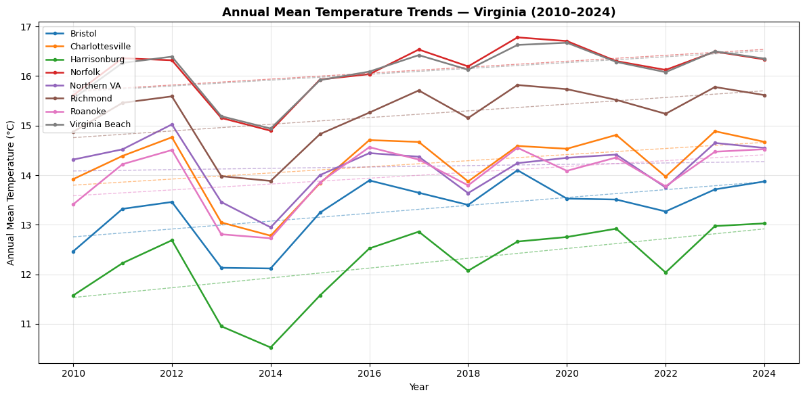
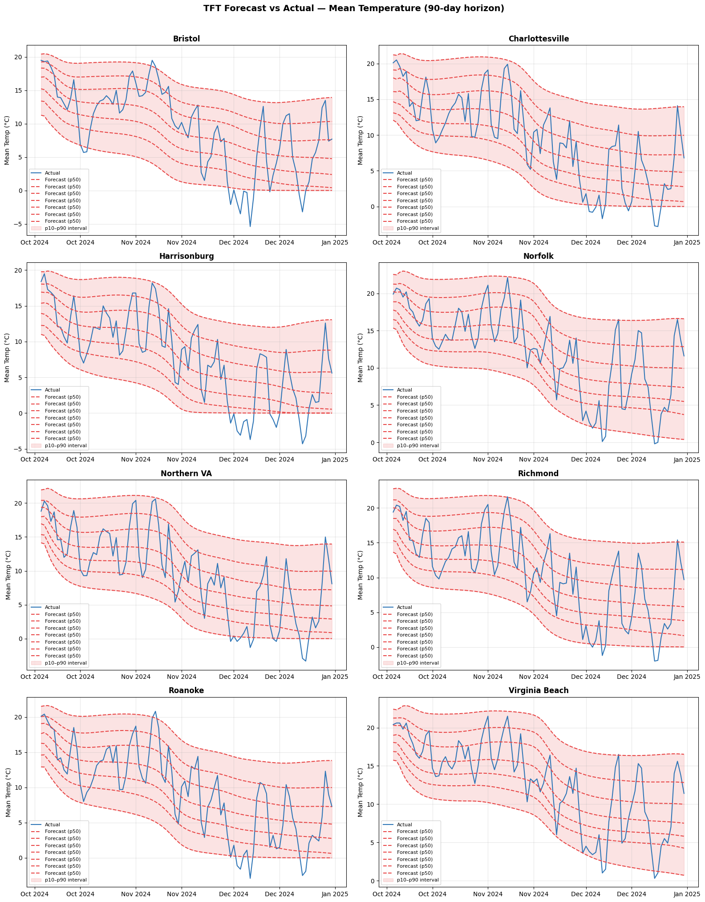
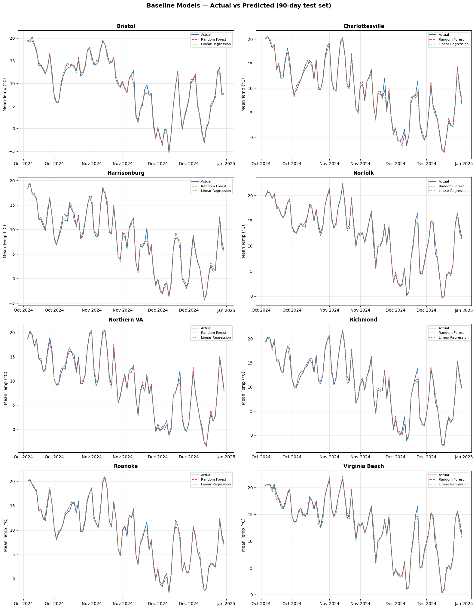
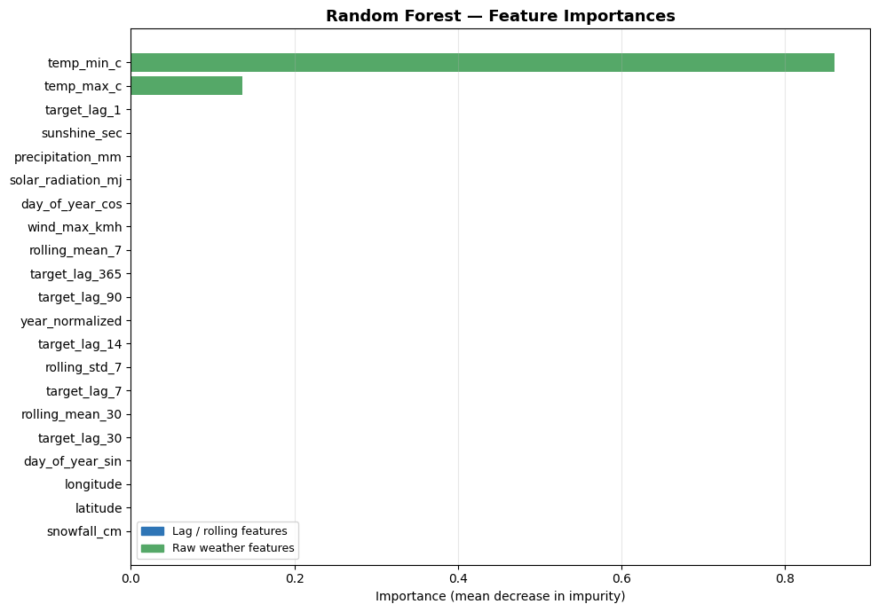
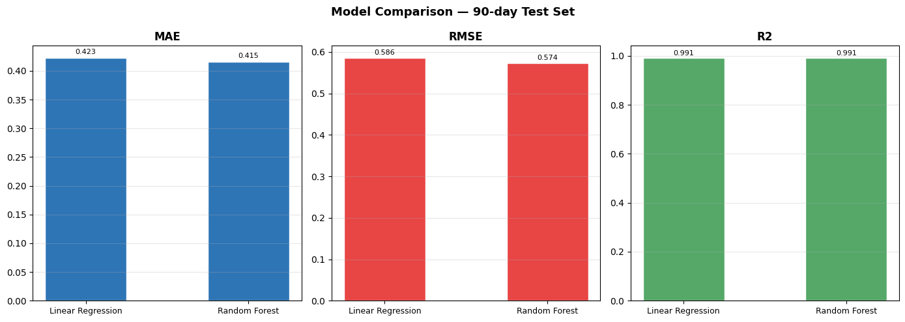

```python
import scripts.data as data
from pymongo import MongoClient
from dotenv import load_dotenv
import os

load_dotenv(override=True)

data.run()
```

    Connected successfully!
      Collection 'weather' already exists, skipping creation.
    Fetching Richmond (Central)...
      No nulls found.
      Inserted 5,479 daily records.
    Fetching Virginia Beach (Coastal)...
      No nulls found.
      Inserted 5,479 daily records.
    Fetching Charlottesville (Piedmont)...
      Already have 5,479 docs for Charlottesville, skipping.
    Fetching Roanoke (Southwest)...
      Already have 5,479 docs for Roanoke, skipping.
    Fetching Harrisonburg (Shenandoah)...
      Already have 5,479 docs for Harrisonburg, skipping.
    Fetching Northern VA (Northern)...
      Already have 5,479 docs for Northern VA, skipping.
    Fetching Norfolk (Coastal)...
      Already have 5,479 docs for Norfolk, skipping.
    Fetching Bristol (Appalachian)...
      Already have 5,479 docs for Bristol, skipping.
    
    Done. Total records inserted: 10,958
    
    ── Verification ──────────────────────────────────────
      Total docs in collection: 43,832
      Bristol               5479 days  2010-01-01 → 2024-12-31
      Charlottesville       5479 days  2010-01-01 → 2024-12-31
      Harrisonburg          5479 days  2010-01-01 → 2024-12-31
      Norfolk               5479 days  2010-01-01 → 2024-12-31
      Northern VA           5479 days  2010-01-01 → 2024-12-31
      Richmond              5479 days  2010-01-01 → 2024-12-31
      Roanoke               5479 days  2010-01-01 → 2024-12-31
      Virginia Beach        5479 days  2010-01-01 → 2024-12-31
    Total documents: 43,832
    Date range: 2010-01-01 → 2024-12-31
    
    Per-location doc counts:
      Bristol                  5479 days
      Charlottesville          5479 days
      Harrisonburg             5479 days
      Norfolk                  5479 days
      Northern VA              5479 days
      Richmond                 5479 days
      Roanoke                  5479 days
      Virginia Beach           5479 days
    
    Numerical feature stats:
      temp_max_c                   min=  -13.20  max=   40.50  mean=   19.48  nulls=0.0%
      temp_min_c                   min=  -25.60  max=   28.90  mean=    9.95  nulls=0.0%
      temp_mean_c                  min=  -16.50  max=   33.60  mean=   14.42  nulls=0.0%
      precipitation_mm             min=    0.00  max=  157.10  mean=    3.06  nulls=0.0%
      rain_mm                      min=    0.00  max=  157.10  mean=    2.94  nulls=0.0%
      snowfall_cm                  min=    0.00  max=   32.34  mean=    0.09  nulls=0.0%
      wind_max_kmh                 min=    3.30  max=   72.60  mean=   16.39  nulls=0.0%
      wind_gust_kmh                min=    9.40  max=  137.20  mean=   36.71  nulls=0.0%
      wind_direction_deg           min=    0.00  max=  360.00  mean=  199.98  nulls=0.0%
      evapotranspiration_mm        min=    0.14  max=    8.84  mean=    2.96  nulls=0.0%
      precip_hours                 min=    0.00  max=   24.00  mean=    3.44  nulls=0.0%
      sunshine_sec                 min=    0.00  max=52243.79  mean=32793.09  nulls=0.0%
      solar_radiation_mj           min=    0.44  max=   31.60  mean=   15.57  nulls=0.0%
    
    Approx doc size (str repr): 544 bytes
    Collection logical size: 2.66 MB
    Collection storage size: 2.16 MB
    
    Saved weather_stats.json


```python
import scripts.analysis as analysis
import scripts.baseline_models as baseline

df = analysis.run()
baseline.run_baseline_models(df)
```

    Loading data from MongoDB...
    Null counts right after DataFrame construction:
    Series([], dtype: int64)
      Loaded 43,832 records across 8 locations.
    After cyclical encoding: 0 nulls
    After year_normalized: 0 nulls
    After time_idx: 0 nulls
      All NaNs resolved.
    
    Warming rates per location (linear regression on annual means):
      Bristol                warming rate: +0.794°C/decade
      Charlottesville        warming rate: +0.617°C/decade
      Harrisonburg           warming rate: +0.989°C/decade
      Norfolk                warming rate: +0.599°C/decade
      Northern VA            warming rate: +0.135°C/decade
      Richmond               warming rate: +0.676°C/decade
      Roanoke                warming rate: +0.591°C/decade
      Virginia Beach         warming rate: +0.590°C/decade
    Saved warming_trends.png
    
    Building TimeSeriesDataSet...
      Training samples: 43832
    
    Training Temporal Fusion Transformer...


    GPU available: True (cuda), used: True
    TPU available: False, using: 0 TPU cores
    💡 Tip: For seamless cloud logging and experiment tracking, try installing [litlogger](https://pypi.org/project/litlogger/) to enable LitLogger, which logs metrics and artifacts automatically to the Lightning Experiments platform.
    LOCAL_RANK: 0 - CUDA_VISIBLE_DEVICES: [0]


      Model parameters: 358,857


<pre style="white-space:pre;overflow-x:auto;line-height:normal;font-family:Menlo,'DejaVu Sans Mono',consolas,'Courier New',monospace">┏━━━━┳━━━━━━━━━━━━━━━━━━━━━━━━━━━━━━━━━━━━┳━━━━━━━━━━━━━━━━━━━━━━━━━━━━━━━━━┳━━━━━━━━┳━━━━━━━┳━━━━━━━┓
┃<span style="color: #800080; text-decoration-color: #800080; font-weight: bold">    </span>┃<span style="color: #800080; text-decoration-color: #800080; font-weight: bold"> Name                               </span>┃<span style="color: #800080; text-decoration-color: #800080; font-weight: bold"> Type                            </span>┃<span style="color: #800080; text-decoration-color: #800080; font-weight: bold"> Params </span>┃<span style="color: #800080; text-decoration-color: #800080; font-weight: bold"> Mode  </span>┃<span style="color: #800080; text-decoration-color: #800080; font-weight: bold"> FLOPs </span>┃
┡━━━━╇━━━━━━━━━━━━━━━━━━━━━━━━━━━━━━━━━━━━╇━━━━━━━━━━━━━━━━━━━━━━━━━━━━━━━━━╇━━━━━━━━╇━━━━━━━╇━━━━━━━┩
│<span style="color: #7f7f7f; text-decoration-color: #7f7f7f"> 0  </span>│ loss                               │ QuantileLoss                    │      0 │ train │     0 │
│<span style="color: #7f7f7f; text-decoration-color: #7f7f7f"> 1  </span>│ logging_metrics                    │ ModuleList                      │      0 │ train │     0 │
│<span style="color: #7f7f7f; text-decoration-color: #7f7f7f"> 2  </span>│ input_embeddings                   │ MultiEmbedding                  │     40 │ train │     0 │
│<span style="color: #7f7f7f; text-decoration-color: #7f7f7f"> 3  </span>│ prescalers                         │ ModuleDict                      │  1.3 K │ train │     0 │
│<span style="color: #7f7f7f; text-decoration-color: #7f7f7f"> 4  </span>│ static_variable_selection          │ VariableSelectionNetwork        │ 34.9 K │ train │     0 │
│<span style="color: #7f7f7f; text-decoration-color: #7f7f7f"> 5  </span>│ encoder_variable_selection         │ VariableSelectionNetwork        │  109 K │ train │     0 │
│<span style="color: #7f7f7f; text-decoration-color: #7f7f7f"> 6  </span>│ decoder_variable_selection         │ VariableSelectionNetwork        │  6.7 K │ train │     0 │
│<span style="color: #7f7f7f; text-decoration-color: #7f7f7f"> 7  </span>│ static_context_variable_selection  │ GatedResidualNetwork            │ 16.8 K │ train │     0 │
│<span style="color: #7f7f7f; text-decoration-color: #7f7f7f"> 8  </span>│ static_context_initial_hidden_lstm │ GatedResidualNetwork            │ 16.8 K │ train │     0 │
│<span style="color: #7f7f7f; text-decoration-color: #7f7f7f"> 9  </span>│ static_context_initial_cell_lstm   │ GatedResidualNetwork            │ 16.8 K │ train │     0 │
│<span style="color: #7f7f7f; text-decoration-color: #7f7f7f"> 10 </span>│ static_context_enrichment          │ GatedResidualNetwork            │ 16.8 K │ train │     0 │
│<span style="color: #7f7f7f; text-decoration-color: #7f7f7f"> 11 </span>│ lstm_encoder                       │ LSTM                            │ 33.3 K │ train │     0 │
│<span style="color: #7f7f7f; text-decoration-color: #7f7f7f"> 12 </span>│ lstm_decoder                       │ LSTM                            │ 33.3 K │ train │     0 │
│<span style="color: #7f7f7f; text-decoration-color: #7f7f7f"> 13 </span>│ post_lstm_gate_encoder             │ GatedLinearUnit                 │  8.3 K │ train │     0 │
│<span style="color: #7f7f7f; text-decoration-color: #7f7f7f"> 14 </span>│ post_lstm_add_norm_encoder         │ AddNorm                         │    128 │ train │     0 │
│<span style="color: #7f7f7f; text-decoration-color: #7f7f7f"> 15 </span>│ static_enrichment                  │ GatedResidualNetwork            │ 20.9 K │ train │     0 │
│<span style="color: #7f7f7f; text-decoration-color: #7f7f7f"> 16 </span>│ multihead_attn                     │ InterpretableMultiHeadAttention │ 10.4 K │ train │     0 │
│<span style="color: #7f7f7f; text-decoration-color: #7f7f7f"> 17 </span>│ post_attn_gate_norm                │ GateAddNorm                     │  8.4 K │ train │     0 │
│<span style="color: #7f7f7f; text-decoration-color: #7f7f7f"> 18 </span>│ pos_wise_ff                        │ GatedResidualNetwork            │ 16.8 K │ train │     0 │
│<span style="color: #7f7f7f; text-decoration-color: #7f7f7f"> 19 </span>│ pre_output_gate_norm               │ GateAddNorm                     │  8.4 K │ train │     0 │
│<span style="color: #7f7f7f; text-decoration-color: #7f7f7f"> 20 </span>│ output_layer                       │ Linear                          │    455 │ train │     0 │
└────┴────────────────────────────────────┴─────────────────────────────────┴────────┴───────┴───────┘
</pre>


<pre style="white-space:pre;overflow-x:auto;line-height:normal;font-family:Menlo,'DejaVu Sans Mono',consolas,'Courier New',monospace"><span style="font-weight: bold">Trainable params</span>: 358 K                                                                                            
<span style="font-weight: bold">Non-trainable params</span>: 0                                                                                            
<span style="font-weight: bold">Total params</span>: 358 K                                                                                                
<span style="font-weight: bold">Total estimated model params size (MB)</span>: 1                                                                          
<span style="font-weight: bold">Modules in train mode</span>: 465                                                                                         
<span style="font-weight: bold">Modules in eval mode</span>: 0                                                                                            
<span style="font-weight: bold">Total FLOPs</span>: 0                                                                                                     
</pre>


    Metric val_loss improved. New best score: 1.822
    Metric val_loss improved by 0.071 >= min_delta = 0.0. New best score: 1.751
    Metric val_loss improved by 0.024 >= min_delta = 0.0. New best score: 1.727
    Monitored metric val_loss did not improve in the last 8 records. Best score: 1.727. Signaling Trainer to stop.


<pre style="white-space:pre;overflow-x:auto;line-height:normal;font-family:Menlo,'DejaVu Sans Mono',consolas,'Courier New',monospace"></pre>


    GPU available: True (cuda), used: True
    TPU available: False, using: 0 TPU cores
    💡 Tip: For seamless cloud logging and experiment tracking, try installing [litlogger](https://pypi.org/project/litlogger/) to enable LitLogger, which logs metrics and artifacts automatically to the Lightning Experiments platform.
    💡 Tip: For seamless cloud uploads and versioning, try installing [litmodels](https://pypi.org/project/litmodels/) to enable LitModelCheckpoint, which syncs automatically with the Lightning model registry.
    LOCAL_RANK: 0 - CUDA_VISIBLE_DEVICES: [0]


    
    Generating forecast plots...
    Saved tft_forecasts.png
    
    Done. Output files:
      warming_trends.png  — annual trend lines per location
      tft_forecasts.png   — 90-day forecast vs actual per location
      tft_attention.png   — variable importance + temporal attention weights
    
    ── Baseline Models ───────────────────────────────────
    Building tabular dataset with lag features...
      Features: 21  |  Rows: 40,912
      Train rows: 40,192  |  Test rows: 720
    Training models...
    
    Test set metrics (90-day hold-out):
      Linear Regression          MAE=0.423°C   RMSE=0.586°C   R²=0.9911
      Random Forest              MAE=0.415°C   RMSE=0.574°C   R²=0.9914
    
    Generating baseline plots...
    Saved images/baseline_forecasts.png
    Saved images/rf_feature_importance.png
    Saved images/model_comparison.png


    (RandomForestRegressor(max_depth=12, min_samples_leaf=5, n_estimators=200,
                           n_jobs=-1, random_state=42),
     LinearRegression(),
     [{'model': 'Linear Regression',
       'MAE': 0.422575246946157,
       'RMSE': np.float64(0.5856654887182281),
       'R2': 0.991064419012005},
      {'model': 'Random Forest',
       'MAE': 0.4153751617395563,
       'RMSE': np.float64(0.5735042041569245),
       'R2': 0.9914316590276584}])


    

    


    

    


    

    


    

    


    

    


```python
from pymongo import MongoClient
from dotenv import load_dotenv
import os

load_dotenv(override=True)

client = MongoClient(
    os.environ["MONGOHOST"],
    username=os.environ["MONGOUSER"],
    password=os.environ["MONGOPASS"],
)
collection = client["weather_db"]["weather"]

# Find docs where temp_mean_c is null
null_docs = list(collection.find(
    {"temp_mean_c": None},
    {"metadata.location": 1, "timestamp": 1, "temp_mean_c": 1}
))

print(f"Total null temp_mean_c docs: {len(null_docs)}")

# Count by location
from collections import Counter
by_loc = Counter(d["metadata"]["location"] for d in null_docs)
for loc, count in sorted(by_loc.items()):
    print(f"  {loc}: {count} null docs")

sample = collection.find_one({"metadata.location": "Richmond"})
print(sample.keys())
print(sample.get("temp_mean_c"))

client.close()
```

    Total null temp_mean_c docs: 0
    dict_keys(['timestamp', 'metadata', 'solar_radiation_mj', 'rain_mm', 'temp_mean_c', 'wind_max_kmh', 'temp_max_c', 'evapotranspiration_mm', 'precip_hours', 'temp_min_c', '_id', 'wind_gust_kmh', 'precipitation_mm', 'snowfall_cm', 'wind_direction_deg', 'sunshine_sec'])
    2.8


```python

```
